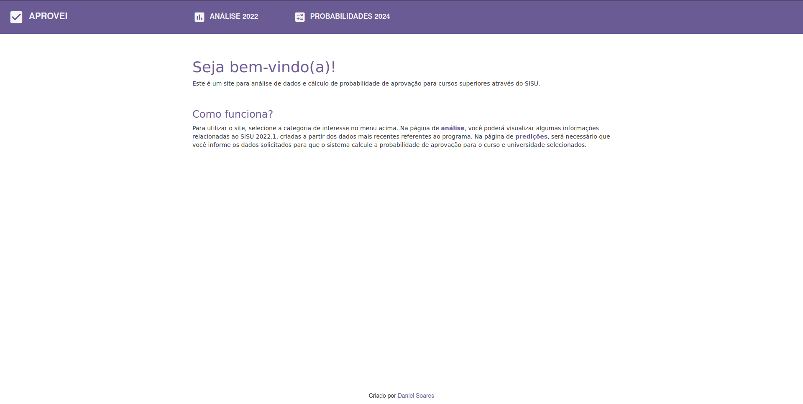
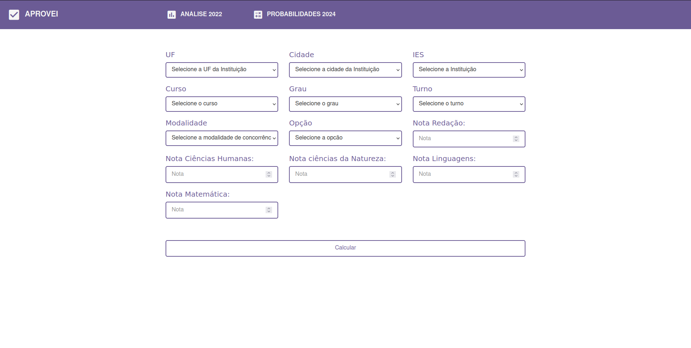
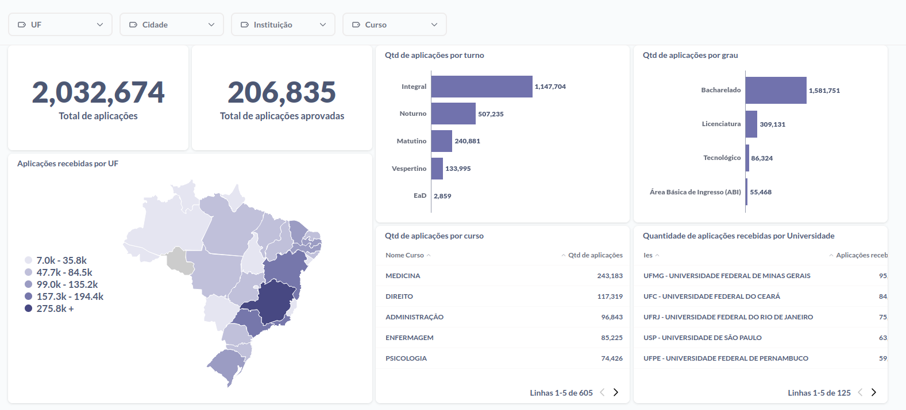
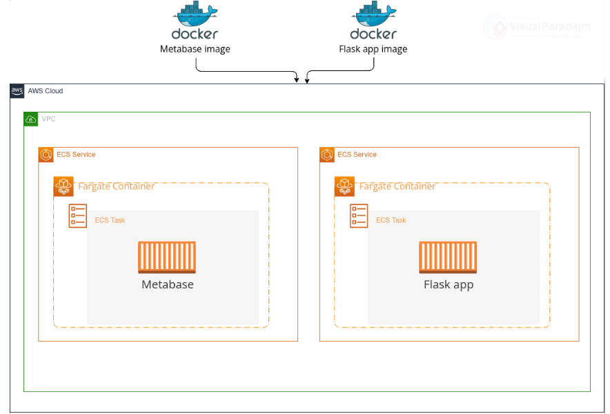

### Sobre o problema

O SISU é um evento esperado por muitos estudantes que desejam ingressar em uma 
universidade pública. O processo seletivo é realizado duas vezes ao ano, no 
início de cada semestre letivo, e utiliza a nota do ENEM como critério de 
seleção. 

Dado ao número alto de participantes, um dos principais questionamentos que toma 
conta dos estudantes é: "Será que minha nota é o suficiente?".

### Objetivo

Como objetivo inicial, é necessário a criação de um relatório que apresente
informações probabilísticas sobre o processo seletivo do SISU. O relatório deve
passar por tópicos como: turno, cotas, grau, etc.

Como objetivo final, é necessário a criação de um modelo de aprendizado de
máquina que seja capaz de prever a probabilidade do estudante de ser aprovado 
nos cursos que ele escolheu. Também é necessário realizar o deploy do modelo em
conjunto com um relatório sobre as universidades e cursos.

### Sobre os dados

Os dados utilizados foram obtidos através do portal de dados abertos do governo
federal. Os dados são referentes ao SISU 2022.1. Devido a restrição de espaço
no github, os dados não foram adicionados ao repositório. Para baixá-los,
acesse o link abaixo:

[Dados SISU](https://dadosabertos.mec.gov.br/images/conteudo/sisu/2022/chamada_regular_sisu_2022_1.csv)

Para um bom funcionamento, crie uma pasta chamada "raw" dentro da pasta data e adicione os dados dentro dela.

### Métricas de avaliação

Como o interesse é a probabilidade de aprovação, a métrica de avaliação será a
**Log Loss**.

### Melhorias

[⌛] Testar mais hiperparâmetros

[✅] Realizar o deploy do modelo

[✅] Criar um relatório sobre as universidades e cursos

[⌛] Criar uma camada de monitoramento

### Instruções para execução do projeto

Para executar o projeto, é necessário que você tenha o Docker instalado na sua máquina. Estando atendendo ao requisito anterior, basta seguir os seguintes passos para rodar o projeto localmente:

1. Clone o repositório:
```sh
git clone https://github.com/dnsrsdata/sisu_analysis
```
2. inicie os containers a partir do docker-compose
```sh
docker-compose up --build
```

### Descrição dos arquivos

    - app
    |- static
    | |- style.css  # CSS contendo o estilo da aplicação
    |- templates
    | |- analise.html  # HTML contendo a estruturação da página de análise
    | |- index.html  # HTML contendo a estruturação da página inicial
    | |- predicoes.html  # HTML contendo a estruturação da página de predição
    |- app.py  # Arquivo contendo a aplicação web
    |- dados_to_web.db  # Databse contendo os dados para o dashboard
    |- Dockerfile  # Arquivo contendo as instruções para a criação da imagem do Metabase
    |
    - data
    |- processed
    | |- dados_transformados.parquet  # Dados obtidos após a transformação
    | |- dados_to_web.db  # Dados que serão consumidos pelo app
    |- raw
    | |- chamada_regular_sisu_2022_1.csv  # Dados brutos obtidos do portal de dados abertos do MEC
    |
    - images
    |- dash_completo.png  # Imagem contendo o dashboard completo
    |- diagrama_implantacao.png  # Imagem contendo o diagrama de implantação
    |- tela_dash_app.png  # Imagem contendo a tela do dashboard na aplicação
    |- tela_inicial_app.png  # Imagem contendo a tela inicial da aplicação
    |- tela_preditor_app.png  # Imagem contendo a tela do preditor na aplicação
    |
    - models
    |- best_lr.pkl  # Modelo treinado
    |
    - notebooks
    |- data_preparation.ipynb  # Notebook contendo a preparação dos dados
    |- models.experimentation.ipynb  # Notebook contendo a experimentação dos modelos
    |- Probabilidades_SISU.ipynb  # Notebook contendo a análise probabilística
    |
    - relatorio
    |- SISU com Dados.pdf  # Relatório contendo os resultados da análise probabilística
    |
    - .dockerignore  # Arquivo contendo as folders para o docker ignorar
    - .gitattributes  # Arquivo contendo as configurações do git lfs
    - .gitignore  # Arquivo contendo as folders para o git ignorar
    - dados_to_web.db  # Cópia do database gerado pelo Metabase
    - docker-compose.yml  # Arquivo contendo as configurações do docker-compose
    - Dockerfile  # Arquivo contendo as instruções para a criação da imagem do app
    - README.md  # Arquivo contando informações do projeto
    - requirements.txt # Arquivo contendo as dependências do projeto

### Resultados

A análise probabilística pode ser conferida no pdf ```SISU com Dados.pdf``` na pasta
relatorio.

Como resultado do modelo, foi obtido uma log loss de 0.23. A respeito da sua
implantação, foi criado toda ma aplicação web para suportar, além do modelo, um
dashboard com informações sobre as aplicações. Confira abaixo prints da
aplicação:





Para uma melhor visualização do dashboard, confira a imagem abaixo:


Para a implantação do dashboard em conjunto da aplicação, foi utilizado a AWS.
A implantação foi realizada conforme o diagrama abaixo:
