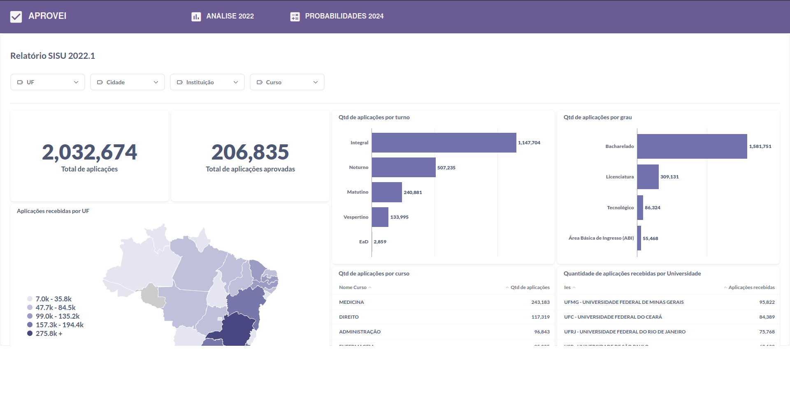

### Sobre o problema

O SISU é um evento esperado por muitos estudantes que desejam ingressar em uma 
universidade pública. O processo seletivo é realizado duas vezes ao ano, no 
início de cada semestre letivo, e utiliza a nota do ENEM como critério de 
seleção. 

Dado ao número alto de participantes, um dos principais questionamentos que toma 
conta dos estudantes é: "Será que minha nota é o suficiente?".

### Objetivo

Como objetivo inicial, é necessário a criação de um relatório que apresente
informações probabilísticas sobre o processo seletivo do SISU. O relatório deve
passar por tópicos como: turno, cotas, grau, etc.

Como objetivo final, é necessário a criação de um modelo de aprendizado de
máquina que seja capaz de prever a probabilidade do estudante de ser aprovado 
nos cursos que ele escolheu. Também é necessário realizar o deploy do modelo em
conjunto com um relatório sobre as universidades e cursos.

### Sobre os dados

Os dados utilizados foram obtidos através do portal de dados abertos do governo
federal. Os dados são referentes ao SISU 2022.1. Devido a restrição de espaço
no github, os dados não foram adicionados ao repositório. Para baixar os dados,
acesse o link abaixo:

[Dados SISU](https://dadosabertos.mec.gov.br/images/conteudo/sisu/2022/chamada_regular_sisu_2022_1.csv)

Para um bom funcionamento, crie uma pasta chamada "raw" dentro da pasta data e adicione os dados dentro dela.

### Métricas de avaliação

Como o interesse é a probabilidade de aprovação, a métrica de avaliação será a
**Log Loss**.

### Melhorias

[⌛] Testar mais hiperparâmetros

[⌛] Realizar o deploy do modelo

[⌛] Criar um relatório sobre as universidades e cursos

### Instruções para execução do projeto

Para executar o projeto, é necessário que você tenha o Docker instalado na sua máquina. Estando atendendo ao requisito anterior, basta seguir os seguintes passos para rodar o projeto localmente:

1. Clone o repositório:
```sh
git clone https://github.com/dnsrsdata/sisu_analysis
```
2. inicie os containers a partir do docker-compose
```sh
docker-compose up --build
```

### Descrição dos arquivos


### Resultados

A análise probabilística pode ser conferida no pdf ```SISU com Dados.pdf``` na pasta
relatorio.

Como resultado do modelo, foi obtido uma log loss de 0.23. A respeito da sua
implantação, foi criado toda ma aplicação web para suportar, além do modelo, um
dashboard com informações sobre as aplicações. Confira abaixo prints da
aplicação:





Para uma melhor visualização do dashboard, confira a imagem abaixo:
